## Задание 2. Проектирование решения

Используя подход Privacy by Design, проведите анализ и предложите механизмы для предупреждения возможных рисков, 
связанных с конфиденциальностью. Ваша задача — спроектировать механизмы управления такими рисками до момента реализации 
изменений в проектируемой системе.

В рамках этого задания вам нужно проанализировать состояние As-Is и оценить, как спроектировать решение с учётом требований To-Be.
Что нужно сделать

1. Предложить новые блоки в архитектуру проектируемой системе С4, которые обеспечат соблюдение принципов Privacy By Design во многих блоках реализуемой системы.
2. Предложить в целевой архитектуре слой, который обеспечивает аналитическую работу с данными системы с учётом принципов Privacy by Design.

Когда задание будет готово, загрузите диаграмму контекста C4 целевого состояния системы в директорию Task2 в рамках пул-реквеста.

### Предлагаемое решение

Для обеспечения требований бизнеса и соответствия принципам Privacy By Design в рамках будущей системы предлагается реализовать следующие меры:

#### 1. Инфраструктурные компоненты безопасности
В архитектуру добавлены специализированные компоненты для обеспечения безопасности:
- **Identity Provider (Keycloak):** Обеспечивает централизованную аутентификацию и авторизацию пользователей (SSO) и сервисов. Реализует RBAC/ABAC.
- **Secrets Management (HashiCorp Vault):** Обеспечивает безопасное хранение и ротацию секретов (пароли БД, ключи шифрования, API токены). Секреты не хранятся в коде или конфигурационных файлах.
- **Audit Logging (ELK Stack):** Централизованный сбор логов действий пользователей и сервисов. Критично для расследования инцидентов и соответствия требованиям (Compliance).
- **API Gateway:** Единая точка входа, обеспечивающая SSL Termination, Rate Limiting и валидацию запросов.

#### 2. Защита данных (Privacy by Design)
- **Encryption in Transit:** Все взаимодействие между сервисами (East-West) и с клиентами (North-South) происходит по зашифрованным каналам (mTLS/HTTPS).
- **Encryption at Rest:** Данные в базах данных (PostgreSQL) и файловом хранилище (S3) хранятся в зашифрованном виде. Ключи шифрования управляются через Vault.
- **Data Minimization & Retention:** Реализованы политики автоматического удаления данных:
   - Персональные данные удаляются через 5 лет неактивности.
   - Медицинские данные — через 10 лет.
   - По запросу пользователя ("Право на забвение").

#### 3. Безопасная аналитика (Privacy-Preserving Analytics)
Для реализации аналитических функций без нарушения приватности пользователей внедрен отдельный слой:
- **ETL / Anonymization Service:** Специализированный сервис, который извлекает данные из операционных БД, выполняет **маскирование** или **анонимизацию** чувствительных данных (PII/PHI) и загружает их в аналитическое хранилище.
- **Analytical DB (ClickHouse):** Хранит только обезличенные данные, пригодные для аналитики, но не позволяющие идентифицировать конкретных пациентов без дополнительных ключей (которые хранятся отдельно и защищены).
- **Access Control:** Аналитики имеют доступ только к обезличенным данным в ClickHouse через BI инструменты, но не к "сырым" данным в PostgreSQL.

### Диаграмма C4 (Container)

Диаграмма целевого состояния системы (To-Be) доступна в формате draw.io (XML), который можно открыть и редактировать в Diagrams.net:
- [medicamente-c4-to-be.drawio](medicamente-c4-to-be.drawio) (Основной файл)

Для справки также сохранены текстовые описания диаграммы:
- [PlantUML (Source)](medicamente-c4-to-be.puml)
- [Mermaid (Viewable)](medicamente-c4-to-be.mermaid)

```mermaid
C4Context
    title C4 Container Diagram - Medikamente System (To-Be)

    Person(patient, "Patient", "Uses mobile app or web portal to book appointments and view records.")
    Person(staff, "Medical Staff", "Uses internal portal to manage appointments and records.")
    Person(analyst, "Data Analyst", "Analyzes anonymized data for business insights.")

    System_Boundary(medikamente_system, "Medikamente System") {

        Container(web_app, "Web App (Patient Portal)", "React/SPA", "Provides functionality for patients via browser.")
        Container(mobile_app, "Mobile App", "React Native", "Provides functionality for patients via mobile device.")
        Container(internal_web_app, "Internal Portal", "React/SPA", "Provides functionality for staff via browser.")

        Container(api_gateway, "API Gateway", "Nginx/Kong", "Entry point, SSL termination, rate limiting, routing.")

        Container(idp, "Identity Provider", "Keycloak", "Authentication, Authorization, User Management (IAM).")
        Container(vault, "Secrets Management", "HashiCorp Vault", "Stores secrets, encryption keys, and certificates securely.")
        Container(audit, "Audit Logging", "ELK Stack", "Centralized logging for security audit and compliance.")

        Container(patient_service, "Patient Service", "Java/Spring Boot", "Manages patient profiles and PII.")
        Container(appointment_service, "Appointment Service", "Java/Spring Boot", "Manages schedules and appointments.")
        Container(medical_service, "Medical Record Service", "Java/Spring Boot", "Manages sensitive medical records and history.")
        Container(payment_service, "Payment Service", "Java/Spring Boot", "Handles payments and billing.")

        ContainerDb(postgres, "Operational DB", "PostgreSQL", "Stores application data. Encrypted at rest.", "database")
        ContainerDb(object_storage, "File Storage", "S3/MinIO", "Stores medical images and documents. Encrypted at rest.", "database")

        System_Boundary(analytics_layer, "Privacy-Preserving Analytics Layer") {
            Container(etl_service, "ETL / Anonymization Service", "Python/Airflow", "Extracts data, masks PII, and loads into analytical DB.")
            ContainerDb(clickhouse, "Analytical DB", "ClickHouse", "Stores anonymized data for high-performance analytics.", "database")
            Container(bi_tool, "BI Tool", "Superset/Metabase", "Visualization and reporting on anonymized data.")
        }
    }

    Rel(patient, web_app, "Uses", "HTTPS")
    Rel(patient, mobile_app, "Uses", "HTTPS")
    Rel(staff, internal_web_app, "Uses", "HTTPS")

    Rel(web_app, api_gateway, "API calls", "HTTPS/JSON")
    Rel(mobile_app, api_gateway, "API calls", "HTTPS/JSON")
    Rel(internal_web_app, api_gateway, "API calls", "HTTPS/JSON")

    Rel(api_gateway, patient_service, "Routes request", "mTLS/gRPC or HTTPS")
    Rel(api_gateway, appointment_service, "Routes request", "mTLS/gRPC or HTTPS")
    Rel(api_gateway, medical_service, "Routes request", "mTLS/gRPC or HTTPS")
    Rel(api_gateway, payment_service, "Routes request", "mTLS/gRPC or HTTPS")

    Rel(patient_service, idp, "Validates token", "OIDC/OAuth2")
    Rel(appointment_service, idp, "Validates token", "OIDC/OAuth2")
    Rel(medical_service, idp, "Validates token", "OIDC/OAuth2")
    Rel(payment_service, idp, "Validates token", "OIDC/OAuth2")

    Rel(patient_service, vault, "Gets DB credentials/keys", "HTTPS")
    Rel(medical_service, vault, "Gets encryption keys", "HTTPS")

    Rel(patient_service, postgres, "Reads/Writes PII", "JDBC/SSL")
    Rel(appointment_service, postgres, "Reads/Writes schedules", "JDBC/SSL")
    Rel(medical_service, postgres, "Reads/Writes medical data", "JDBC/SSL")
    Rel(medical_service, object_storage, "Stores files", "HTTPS/S3 API")

    Rel(patient_service, audit, "Logs access to PII", "TCP/UDP")
    Rel(medical_service, audit, "Logs access to medical records", "TCP/UDP")

    Rel(etl_service, postgres, "Reads operational data (Replica)", "JDBC/SSL")
    Rel(etl_service, clickhouse, "Writes anonymized data", "Native Protocol")

    Rel(analyst, bi_tool, "Views reports", "HTTPS")
    Rel(bi_tool, clickhouse, "Queries anonymized data", "Native Protocol")
```

